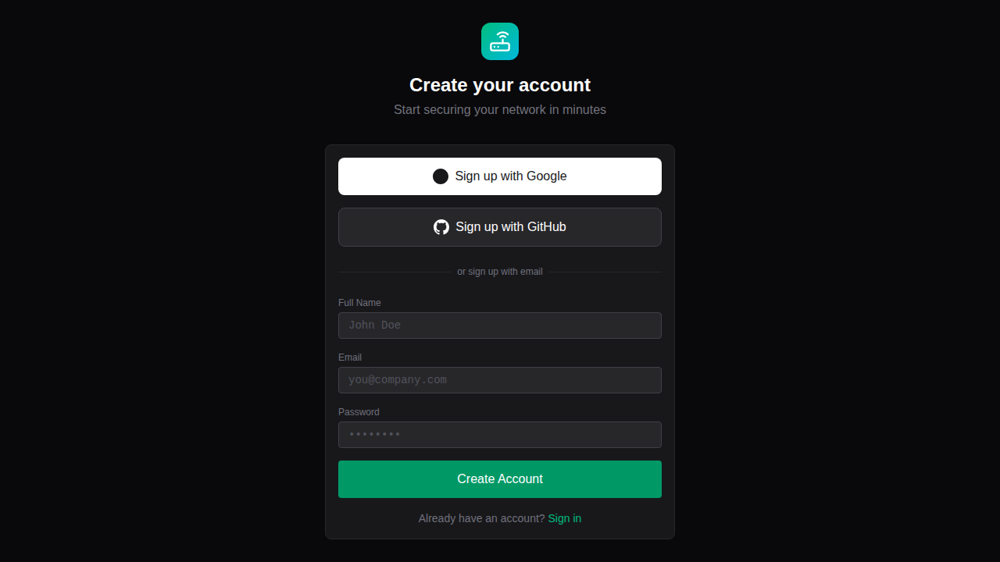
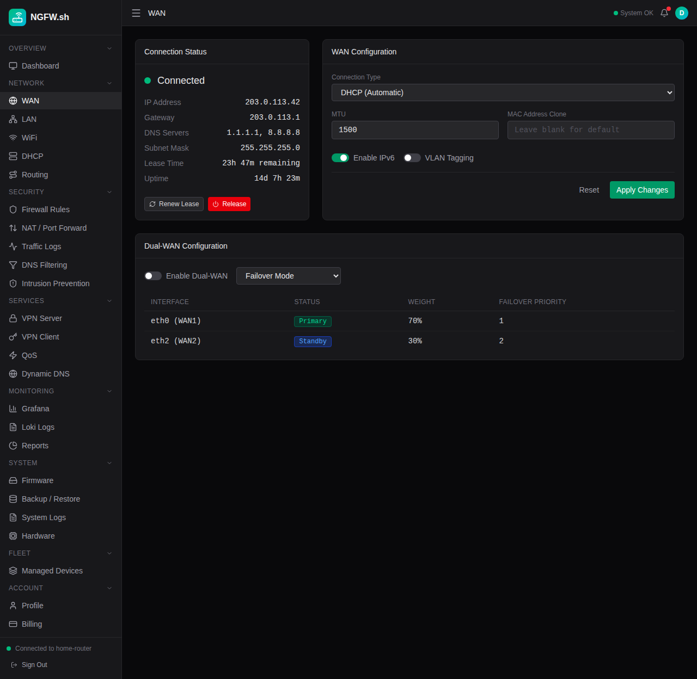
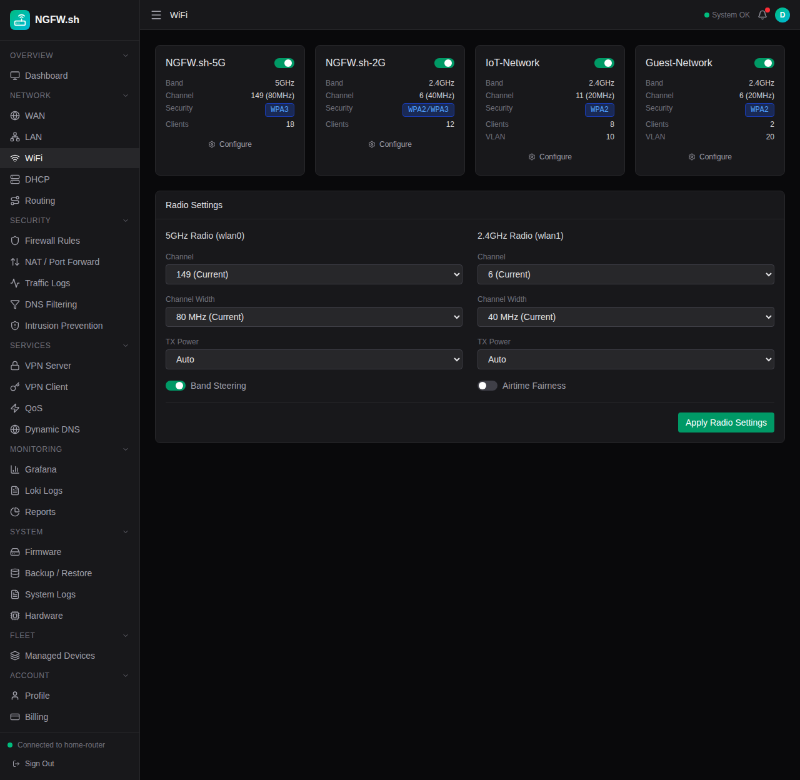

# NGFW.sh

Cloud-managed next-generation firewall and router administration platform.

## Overview

NGFW.sh replaces embedded router web interfaces with an edge-hosted management console. The platform runs on Cloudflare Workers and communicates with on-premises router hardware through an RPC agent.

## Screenshots

> 🎥 **Video Walkthrough**: See the portal in action - [walkthrough.webm](screenshots/walkthrough.webm)

### Login & Authentication
<p align="center">
  
  
</p>

### Dashboard


### Network Configuration
<p align="center">
  
  
</p>

### Security
<p align="center">
  
  
</p>

### Billing & Plans


## Architecture

```
┌─────────────────────────────────────────────────────────────┐
│                   Cloudflare Workers Edge                    │
│  ┌─────────────────┬─────────────────┬───────────────────┐  │
│  │   Web Portal    │   API Server    │   Config Store    │  │
│  │   (React/Vite)  │ (Hono/Chanfana) │    (D1/KV/R2)     │  │
│  └─────────────────┴─────────────────┴───────────────────┘  │
└─────────────────────────────────────────────────────────────┘
                              │
                              │ WebSocket / HTTPS
                              ▼
┌─────────────────────────────────────────────────────────────┐
│                   Router (On-Premises)                       │
│  ┌─────────────────────────────────────────────────────────┐│
│  │   RPC Agent  ←→  nftables / dnsmasq / hostapd / WireGuard││
│  └─────────────────────────────────────────────────────────┘│
└─────────────────────────────────────────────────────────────┘
```

## Project Structure

```
ngfw.sh/
├── portal/           # React web dashboard (ngfw.sh)
├── packages/
│   └── schema/       # API server with OpenAPI spec (specs.ngfw.sh)
├── docs/             # Astro Starlight documentation (docs.ngfw.sh)
└── AGENTS.md         # API specification
```

## Tech Stack

| Component | Technology |
|-----------|------------|
| Web Portal | React 19, Vite 7, Tailwind CSS 4 |
| API Server | Hono, Chanfana (OpenAPI), Cloudflare Workers |
| Documentation | Astro 5, Starlight |
| Database | Cloudflare D1 (SQLite) |
| Key-Value Store | Cloudflare KV |
| Object Storage | Cloudflare R2 |
| Authentication | WorkOS AuthKit |

## Quick Start

### Prerequisites

- [Bun](https://bun.sh) runtime
- [Wrangler](https://developers.cloudflare.com/workers/wrangler/) CLI
- Cloudflare account

### Development

```bash
# Install dependencies
bun install

# Start the portal dev server
cd portal && bun run dev

# Start the API server
cd packages/schema && bun run dev

# Start the docs server
cd docs && bun run dev
```

### Deployment

```bash
# Deploy the portal to ngfw.sh
cd portal && bun run deploy

# Deploy the API to specs.ngfw.sh
cd packages/schema && bun run deploy

# Deploy the docs to docs.ngfw.sh
cd docs && bun run deploy
```

## Features

### Network Configuration
- WAN: DHCP, Static IP, PPPoE, Dual-WAN failover
- LAN: VLANs, Bridge interfaces, Guest networks
- WiFi: Multi-SSID, WPA3, Band steering, RADIUS
- DHCP: IP pools, Static reservations, Lease management

### Security
- Zone-based firewall with rule scheduling
- NAT and port forwarding with UPnP management
- DNS filtering with customizable blocklists
- IDS/IPS with Suricata signatures

### Services
- WireGuard VPN server with QR provisioning
- VPN client with split tunneling
- QoS traffic shaping
- Dynamic DNS

### Monitoring
- Real-time traffic logs with geo-location
- Application detection and threat intelligence
- Grafana and Loki integration
- PDF report generation

### Fleet Management
- Multi-device dashboard
- Configuration templates
- Batch operations

## Subscription Plans

| Plan | Price | Devices | Key Features |
|------|-------|---------|--------------|
| Free | $0 | 5 | Basic firewall, 24h logs |
| Home | $12/mo | 50 | DNS blocking, web filtering |
| Home+ | $24/mo | 100 | VPN (5 peers), parental controls |
| Pro | $60/mo | Unlimited | IDS/IPS, QoS, API access |
| Business | $120/mo | Unlimited | AD/LDAP, HA, compliance |

## Documentation

- **User Docs**: [docs.ngfw.sh](https://docs.ngfw.sh)
- **API Reference**: [specs.ngfw.sh](https://specs.ngfw.sh)
- **API Specification**: [AGENTS.md](./AGENTS.md)

## License

MIT
