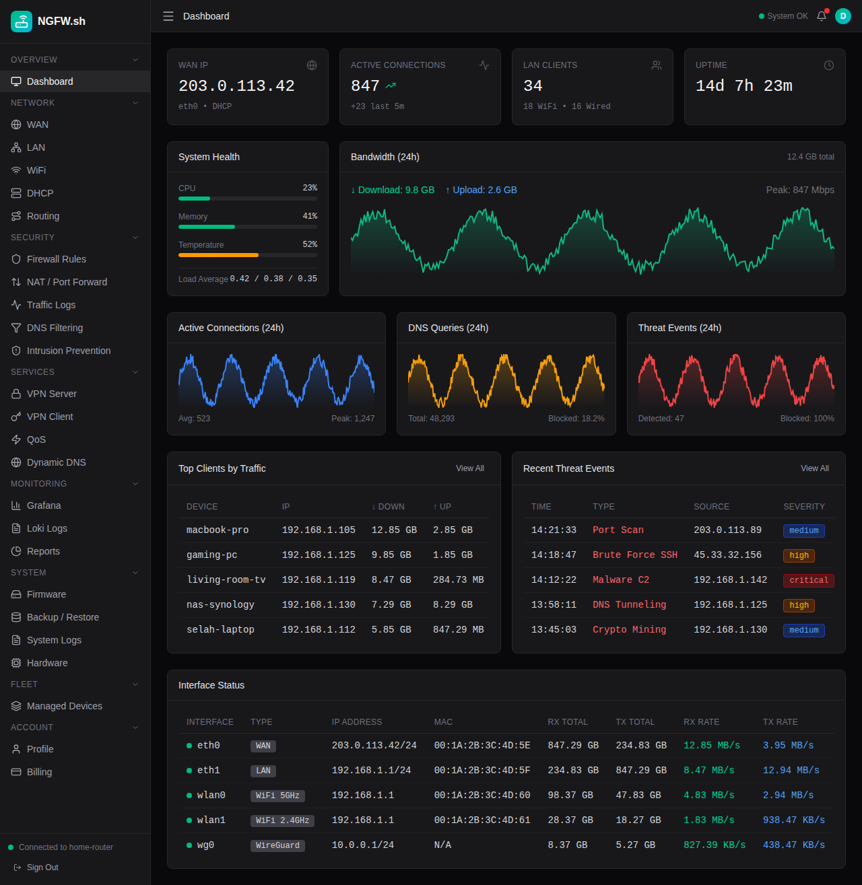
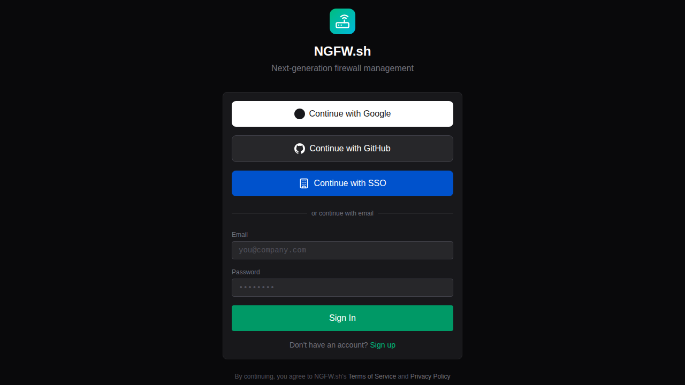
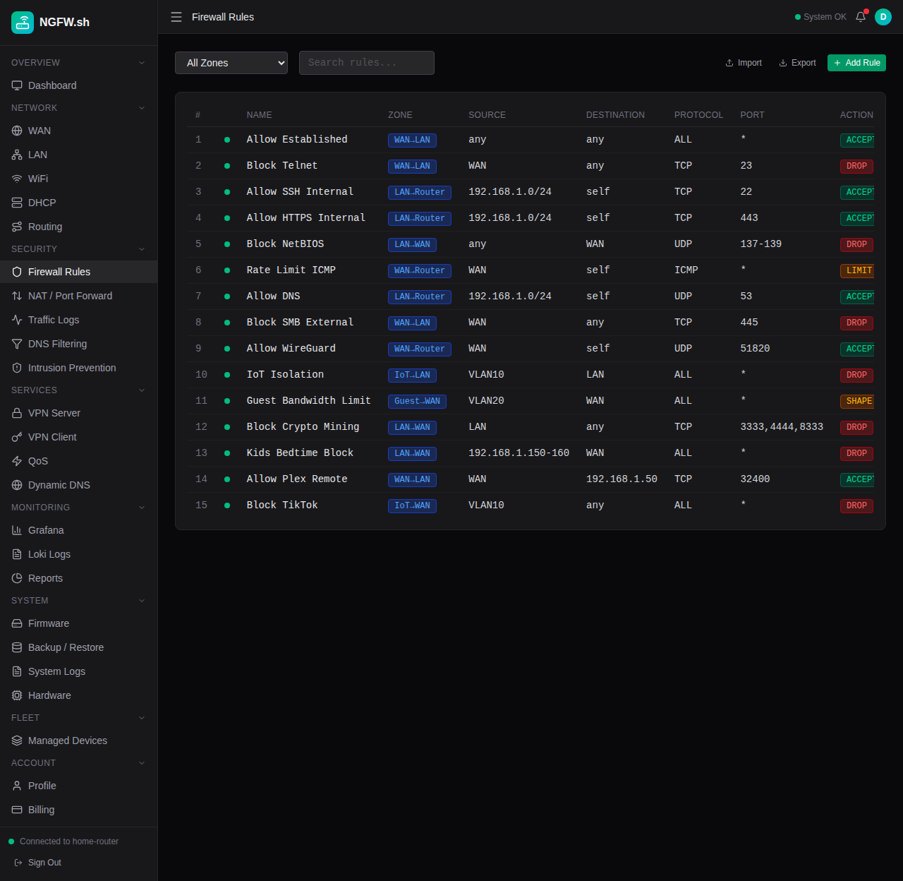
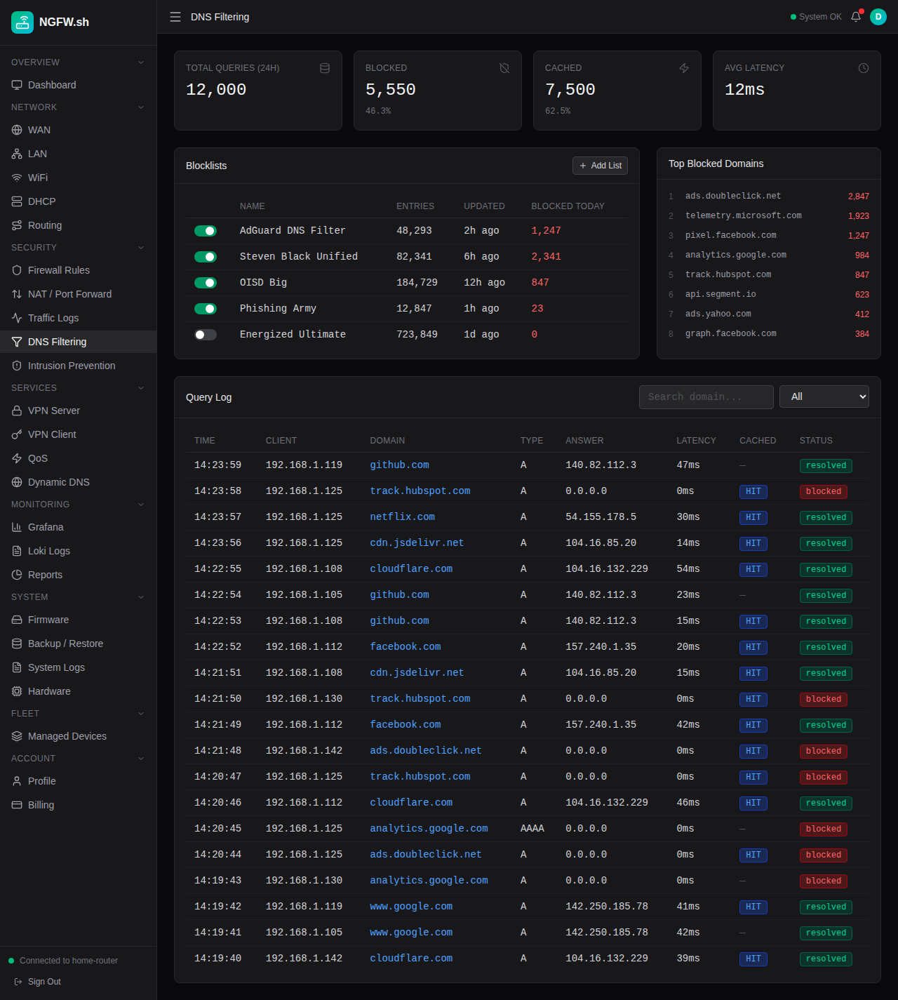
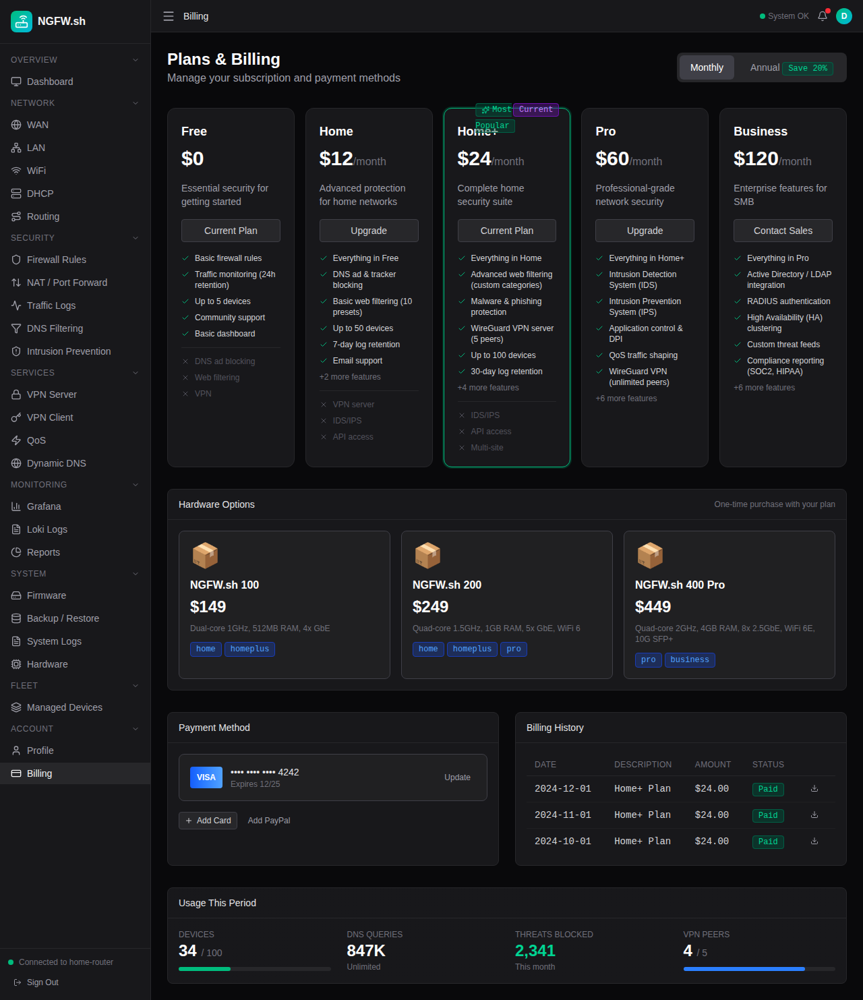

<div align="center">

# 🛡️ NGFW.sh

**Cloud-managed next-generation firewall and router administration platform that runs on Cloudflare's Edge.**

Centralized management, configuration, monitoring, and security — designed with families in mind.

[](LICENSE)
[](https://workers.cloudflare.com/)
[](https://www.typescriptlang.org/)
[](https://github.com/cloudflare/workers-rs)

[Website](https://ngfw.sh) · [Dashboard](https://app.ngfw.sh) · [Documentation](https://docs.ngfw.sh) · [API Reference](https://specs.ngfw.sh)





</div>

---

## ✨ Why NGFW.sh?

<table>
<tr>
<td width="33%" valign="top">

### 🎯 Simple Management

Most router interfaces haven't kept pace with modern expectations. NGFW.sh provides automatic updates, cloud-based management, and security monitoring — no network engineering degree required.

</td>
<td width="33%" valign="top">

### 🔐 Accessible Security

IDS/IPS, DNS filtering, traffic analytics, and VPN management — capabilities that traditionally required enterprise budgets or deep technical expertise, now available to everyone.

</td>
<td width="33%" valign="top">

### 📊 Actionable Insights

Real-time visualization, threat detection, traffic patterns, and device fingerprinting through a cloud dashboard accessible from anywhere with sub-50ms latency globally.

</td>
</tr>
</table>

---

## 🚀 Quick Start

```bash
# 1. Sign up at app.ngfw.sh and register your router
# 2. Install the agent (guided setup, under 5 minutes)
# 3. Manage from the cloud — anywhere, any device
```

The router agent connects via persistent WebSocket through Cloudflare Durable Objects for real-time metrics. Advanced features including firewall rules, DNS filtering, VPN, IDS/IPS, and traffic analytics are rolling out progressively.

---

## 📸 Screenshots

<details>
<summary><b>Authentication</b> — Secure login via Clerk.com with email, phone, MFA, and passkeys</summary>
<br />
<p align="center">
  
  
</p>
</details>

<details>
<summary><b>Dashboard</b> — Real-time system monitoring and status overview</summary>
<br />
<p align="center">
  
</p>
</details>

<details>
<summary><b>Network Configuration</b> — WAN, LAN, and WiFi management</summary>
<br />
<p align="center">
  
  
</p>
</details>

<details>
<summary><b>Security</b> — Firewall rules and DNS filtering</summary>
<br />
<p align="center">
  
  
</p>
</details>

<details>
<summary><b>Billing</b> — Plan management and subscriptions</summary>
<br />
<p align="center">
  
</p>
</details>

---

## 💰 Pricing

> **Feature-based, not usage-based.** No artificial caps on devices, users, VPN peers, firewall rules, or any other metrics. Pay for capabilities, not permission to use your own network.

| | Starter | Pro | Business | Business Plus |
|:---|:---:|:---:|:---:|:---:|
| **Monthly** | $25 | $49 | $99 | $199 |
| **Annual** | $20/mo | $39/mo | $79/mo | $159/mo |
| | | | | |
| Core management & monitoring | ✓ | ✓ | ✓ | ✓ |
| DNS filtering & VPN | ✓ | ✓ | ✓ | ✓ |
| QoS & traffic shaping | — | ✓ | ✓ | ✓ |
| IDS/IPS & real-time alerts | — | ✓ | ✓ | ✓ |
| Fleet management & API | — | — | ✓ | ✓ |
| Priority support & onboarding | — | — | — | ✓ |

<div align="center">

**All plans include a 14-day free trial** · 20% discount on annual billing

</div>

---

## 📋 Feature Comparison

<details>
<summary><b>Cloud Management & Dashboard</b></summary>
<br />

| Feature | Starter | Pro | Business | Business Plus |
|:---|:---:|:---:|:---:|:---:|
| Cloud-hosted management portal | ✓ | ✓ | ✓ | ✓ |
| Real-time system monitoring (CPU, RAM, temp, load) | ✓ | ✓ | ✓ | ✓ |
| Interface statistics & status | ✓ | ✓ | ✓ | ✓ |
| Automatic firmware updates | ✓ | ✓ | ✓ | ✓ |
| Dual boot slot management | ✓ | ✓ | ✓ | ✓ |
| Configuration backup & restore | ✓ | ✓ | ✓ | ✓ |
| Audit log | ✓ | ✓ | ✓ | ✓ |
| Email support | ✓ | ✓ | ✓ | ✓ |
| Priority support (4hr SLA) | — | — | — | ✓ |
| Onboarding assistance | — | — | — | ✓ |

</details>

<details>
<summary><b>Networking</b></summary>
<br />

| Feature | Starter | Pro | Business | Business Plus |
|:---|:---:|:---:|:---:|:---:|
| WAN configuration (DHCP, Static, PPPoE) | ✓ | ✓ | ✓ | ✓ |
| WAN status, DHCP lease renew/release | ✓ | ✓ | ✓ | ✓ |
| LAN / bridge configuration | ✓ | ✓ | ✓ | ✓ |
| VLAN support | ✓ | ✓ | ✓ | ✓ |
| DHCP server & IP pools | ✓ | ✓ | ✓ | ✓ |
| DHCP static reservations | ✓ | ✓ | ✓ | ✓ |
| WiFi radio management | ✓ | ✓ | ✓ | ✓ |
| Multi-SSID configuration | ✓ | ✓ | ✓ | ✓ |
| WiFi client monitoring | ✓ | ✓ | ✓ | ✓ |
| NAT / port forwarding | ✓ | ✓ | ✓ | ✓ |
| UPnP management | ✓ | ✓ | ✓ | ✓ |
| QoS traffic shaping | — | ✓ | ✓ | ✓ |
| Per-device bandwidth limits | — | ✓ | ✓ | ✓ |
| Traffic class definitions | — | ✓ | ✓ | ✓ |
| Dynamic DNS | — | ✓ | ✓ | ✓ |

</details>

<details>
<summary><b>Security</b></summary>
<br />

| Feature | Starter | Pro | Business | Business Plus |
|:---|:---:|:---:|:---:|:---:|
| Stateful firewall | ✓ | ✓ | ✓ | ✓ |
| Zone-based policies | ✓ | ✓ | ✓ | ✓ |
| Rule ordering & hit counters | ✓ | ✓ | ✓ | ✓ |
| DNS filtering (ad & tracker blocking) | ✓ | ✓ | ✓ | ✓ |
| DNS allowlist / custom overrides | ✓ | ✓ | ✓ | ✓ |
| Force blocklist update | ✓ | ✓ | ✓ | ✓ |
| IDS (Intrusion Detection System) | — | ✓ | ✓ | ✓ |
| IPS (Intrusion Prevention System) | — | ✓ | ✓ | ✓ |
| IDS/IPS rule categories | — | ✓ | ✓ | ✓ |
| IDS/IPS custom rules | — | ✓ | ✓ | ✓ |
| Real-time threat alerts (WebSocket) | — | ✓ | ✓ | ✓ |

</details>

<details>
<summary><b>VPN</b></summary>
<br />

| Feature | Starter | Pro | Business | Business Plus |
|:---|:---:|:---:|:---:|:---:|
| WireGuard VPN server | ✓ | ✓ | ✓ | ✓ |
| VPN peer management | ✓ | ✓ | ✓ | ✓ |
| Peer QR code generation | ✓ | ✓ | ✓ | ✓ |
| VPN client profiles | ✓ | ✓ | ✓ | ✓ |
| Connect/disconnect from dashboard | ✓ | ✓ | ✓ | ✓ |
| VPN connection status monitoring | ✓ | ✓ | ✓ | ✓ |

</details>

<details>
<summary><b>Logging & Analytics</b></summary>
<br />

| Feature | Starter | Pro | Business | Business Plus |
|:---|:---:|:---:|:---:|:---:|
| DNS query log & statistics | ✓ | ✓ | ✓ | ✓ |
| Traffic log with filtering (src, dst, port, proto, app, geo) | ✓ | ✓ | ✓ | ✓ |
| Top clients by bandwidth | ✓ | ✓ | ✓ | ✓ |
| Top destinations | ✓ | ✓ | ✓ | ✓ |
| Aggregated traffic statistics | ✓ | ✓ | ✓ | ✓ |
| Real-time traffic stream (WebSocket) | — | ✓ | ✓ | ✓ |

</details>

<details>
<summary><b>Fleet Management & Integration</b></summary>
<br />

| Feature | Starter | Pro | Business | Business Plus |
|:---|:---:|:---:|:---:|:---:|
| Fleet device management | — | — | ✓ | ✓ |
| Configuration templates | — | — | ✓ | ✓ |
| Apply template to multiple devices | — | — | ✓ | ✓ |
| Bulk device commands | — | — | ✓ | ✓ |
| REST API access | — | — | ✓ | ✓ |
| Webhook endpoints | — | — | ✓ | ✓ |

</details>

<details>
<summary><b>Account & Security</b></summary>
<br />

| Feature | Starter | Pro | Business | Business Plus |
|:---|:---:|:---:|:---:|:---:|
| User profile management | ✓ | ✓ | ✓ | ✓ |
| Multi-factor authentication (MFA) | ✓ | ✓ | ✓ | ✓ |
| Passkey support | ✓ | ✓ | ✓ | ✓ |
| Session management | ✓ | ✓ | ✓ | ✓ |

</details>

---

## 🏗️ Architecture

```
┌─────────────────────────────────────────────────────────────────────┐
│                      Cloudflare Workers Edge                         │
│                                                                      │
│   ┌────────────┐  ┌────────────┐  ┌────────────┐  ┌─────────────┐   │
│   │    Web     │  │   Schema   │  │    Rust    │  │   Config    │   │
│   │   Portal   │  │    API     │  │    API     │  │    Store    │   │
│   │            │  │            │  │            │  │             │   │
│   │ React/Vite │  │   Hono/    │  │ workers-rs │  │  D1/KV/R2   │   │
│   │            │  │  Chanfana  │  │            │  │             │   │
│   └────────────┘  └────────────┘  └────────────┘  └─────────────┘   │
│                                                                      │
└─────────────────────────────────────────────────────────────────────┘
                                 │
                                 │  WebSocket / HTTPS
                                 ▼
┌─────────────────────────────────────────────────────────────────────┐
│                        Router (On-Premises)                          │
│                                                                      │
│   ┌───────────────────────────────────────────────────────────┐     │
│   │                        RPC Agent                           │     │
│   │                            ↕                               │     │
│   │       nftables  ·  dnsmasq  ·  hostapd  ·  WireGuard      │     │
│   └───────────────────────────────────────────────────────────┘     │
│                                                                      │
└─────────────────────────────────────────────────────────────────────┘
```

<details>
<summary><b>Services</b></summary>
<br />

| Package | Domain | Purpose |
|:---|:---|:---|
| `packages/portal` | app.ngfw.sh | Dashboard SPA |
| `packages/www` | ngfw.sh | Marketing site |
| `packages/schema` | specs.ngfw.sh | OpenAPI, CRUD, D1 |
| `packages/api` | api.ngfw.sh | WebSocket RPC, Durable Objects |
| `docs/` | docs.ngfw.sh | Documentation (Starlight) |

</details>

<details>
<summary><b>Storage</b></summary>
<br />

| Type | Binding | Purpose |
|:---|:---|:---|
| D1 | `DB` | Users, plans, subscriptions, configs |
| KV | `DEVICES` | Device registry & API keys |
| KV | `CONFIGS` | Device configurations |
| KV | `SESSIONS` | User sessions |
| KV | `CACHE` | Blocklist & threat feed cache |
| R2 | `FIRMWARE` | Firmware images |
| R2 | `BACKUPS` | Configuration backups |
| R2 | `REPORTS` | Generated reports |

</details>

---

## 🛠️ Tech Stack

<table>
<tr>
<td valign="top" width="50%">

**Frontend**
- React 19, Vite 7, Tailwind CSS 4
- Astro 5, Starlight (docs)

**Auth**
- Clerk.com

</td>
<td valign="top" width="50%">

**Backend**
- Hono 4, Chanfana 3 (OpenAPI), Zod 4
- workers-rs, Durable Objects, WebSocket

**Storage**
- Cloudflare D1, KV, R2

</td>
</tr>
</table>

---

## 💻 Development

```bash
# Setup
bun run setup          # Install all dependencies

# Development servers
bun run dev:portal     # Portal        → localhost:5173
bun run dev:schema     # Schema API    → localhost:8787
bun run dev:api        # Rust API      → localhost:8788
bun run dev:www        # Marketing     → localhost:4321
bun run dev:docs       # Documentation → localhost:4322

# Build & Deploy
bun run build          # Build all packages
bun run deploy         # Deploy all packages

# Quality
bun run test           # Run tests
bun run lint           # Lint with oxlint
```

---

## 📚 Documentation

| Resource | Description |
|:---|:---|
| [ARCHITECTURE.md](./ARCHITECTURE.md) | Full technical specification — API endpoints, schemas, RPC protocol |
| [PROJECT.md](./PROJECT.md) | Task tracking, roadmap, and development status |
| [RESEARCH.md](./RESEARCH.md) | Market research and competitive analysis |
| [docs.ngfw.sh](https://docs.ngfw.sh) | User documentation |
| [specs.ngfw.sh](https://specs.ngfw.sh) | Interactive API reference (Swagger/ReDoc) |

---

<div align="center">

**[Website](https://ngfw.sh)** · **[Dashboard](https://app.ngfw.sh)** · **[Docs](https://docs.ngfw.sh)** · **[API](https://specs.ngfw.sh)**

MIT License · Made with ❤️ for families everywhere

</div>
